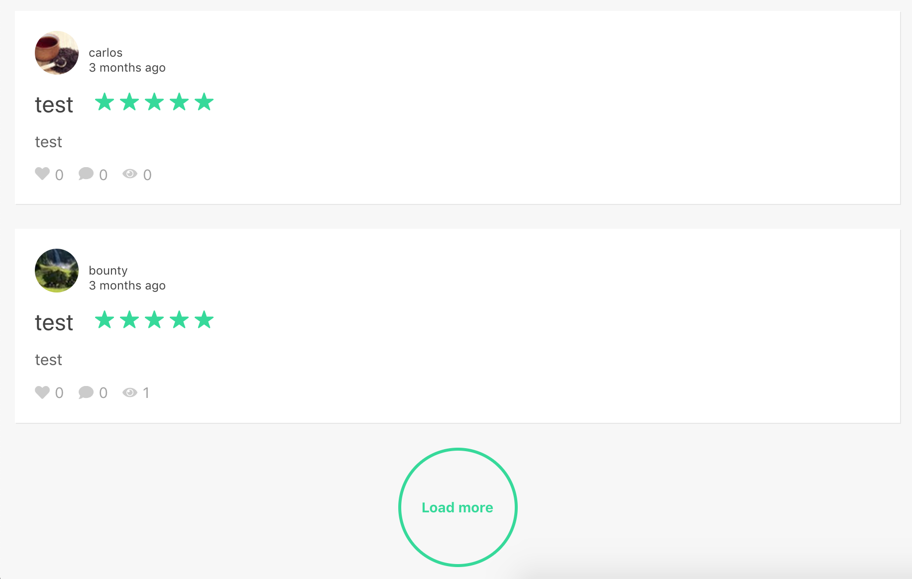

# Feedbacks



This project was bootstrapped with [Create React App](https://github.com/facebook/create-react-app).

## Run the project locally

**1 -** Clone the project and install the dependencies:

```
$ git clone https://github.com/lucasjs/feedbacks
$ cd feedbacks
$ npm install
```
**2 -** Run static server:

```
$ npm run server
```
Open [http://localhost:3004](http://localhost:3004) to view it in the browser.

**3 -** Run development mode:

```
$ npm start
```
Open [http://localhost:3000](http://localhost:3000) to view it in the browser.

**4 -** Run embeddable development mode:

```
$ npm run dev
```
Open [http://localhost:3003](http://localhost:3003) to view it in the browser.


## Scripts

Build:

```
$ npm run build
```

Build embeddable widget:

```
$ npm run build-emb
```
